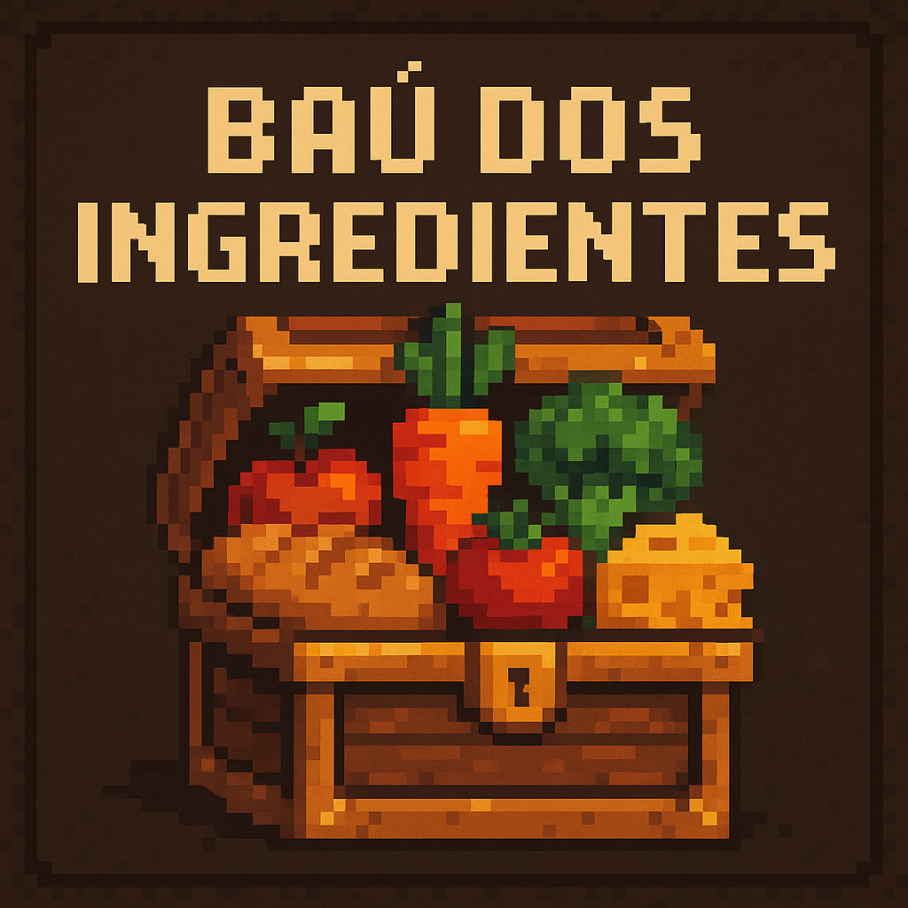
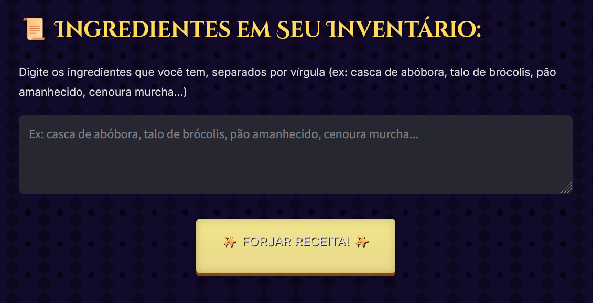
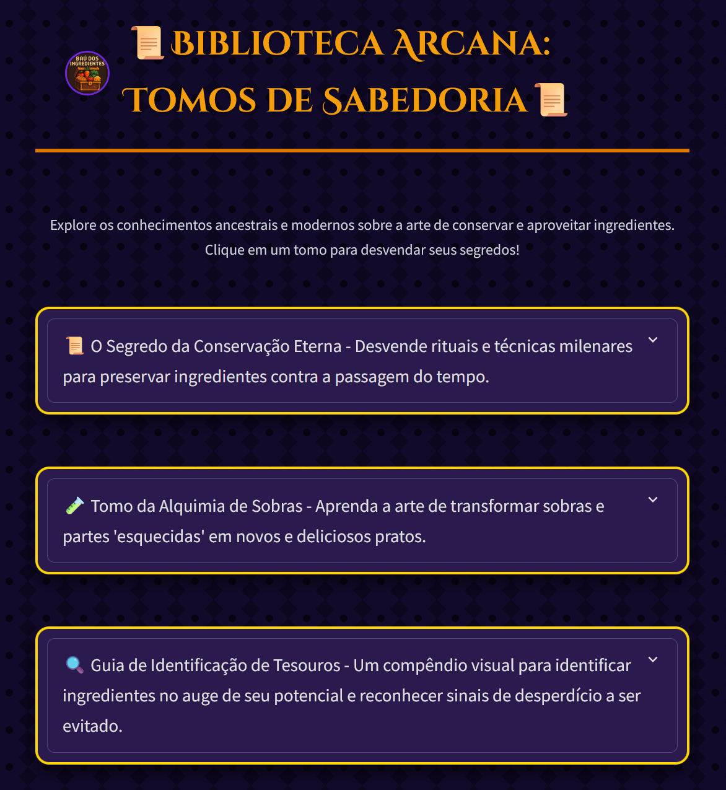
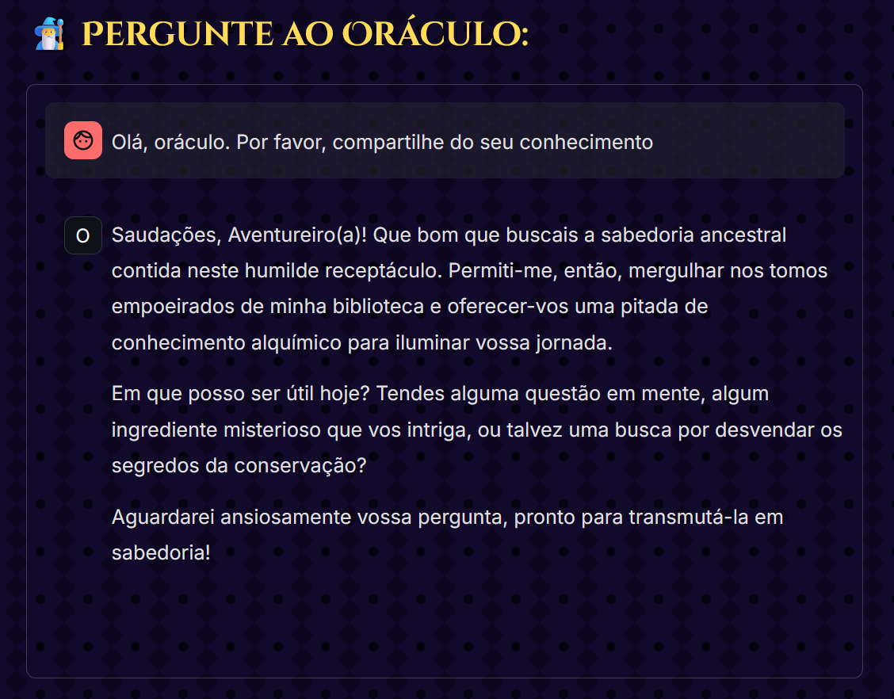

<div aling="center">
  <a href="https://baudereceitas.streamlit.app/">
    
  </a>
</div>
<br>
<p aling="center">
  <a href="https://baudereceitas.streamlit.app" target="_blank" rel="noopener noreferrer"></a>
</p>

# ⚔️ Baú de Receitas ⚔️

**ATENÇÃO, VALENTE AVENTUREIRO DA CULINÁRIA!** 🧑‍🍳✨

Cansado de encontrar aqueles "artefatos esquecidos" 🥔🧅🥕 no fundo da sua masmorra gelada (também conhecida como geladeira 🧊)? Aquelas poções murchas 🧪🥦? Aquelas relíquias petrificadas (pães amanhecidos 🍞🗿)? Em um mundo onde cada moeda de ouro 💰 (e cada ingrediente!) conta, jogar fora preciosos recursos é um crime digno dos calabouços mais profundos! 😠

Mas não tema! Das terras distantes da programação 💻 e alquimia digital ✨, surge o **Baú de Receitas - Sua Forja Pessoal de Fórmulas Épicas!** 🔥📜 Deixe de lado o desespero de olhar para um inventário limitado 🎒 e prepare-se para uma jornada saborosa 🗺️. Com a ajuda de nossos lendários **Mestres Culinários Alquimistas** 🧙‍♂️🍲, transformaremos aqueles itens que pareciam destinados à compostagem 🌱 em verdadeiras obras de arte gastronômicas 🍽️!

Este não é um baú qualquer, é um portal mágico 🔮 que conjura pratos incríveis usando *exatamente* o que você tem em mãos 🙌. Reduza o desperdício, economize suas moedas 💰 e impressione até o mais exigente dos Bardos 🎶 com suas novas habilidades na cozinha 💪. Prepare seus utensílios 🔪🥘, acenda o fogo do dragão 🔥🐉 e que a forja comece! ⚔️

## ✨ Recursos

* **Forja de Fórmulas Épicas:** Gere receitas criativas e personalizadas a partir de uma lista de ingredientes fornecida pelo usuário.

* **Agentes Culinários Alquimistas:** Utiliza uma cadeia de agentes de IA para buscar, planejar e redigir receitas:

    * **Agente Assistente:** Pesquisa receitas online que contenham *apenas* os ingredientes fornecidos.

    * **Agente Cozinheiro:** Analisa as receitas encontradas, seleciona a mais relevante, adapta-a se necessário e sugere toques adicionais (sem adicionar novos ingredientes à receita principal).

    * **Agente Chef:** Transforma o plano da receita em um tutorial passo a passo formatado para um blog, incluindo introdução, ingredientes, modo de preparo, dicas e conclusão.

* **Foco no Aproveitamento:** Incentiva o uso de ingredientes que você já tem, incluindo partes menos convencionais como cascas e talos.

* **Estilo RPG Fantasia:** Interface visual estilizada com temas de RPG, utilizando fontes e cores que remetem a pergaminhos, forjas e magia.

* **Download da Receita:** Permite baixar a receita gerada como um arquivo de texto (`.txt`).

## 🚀 Acesso

1.  Para entrar na forja, **acesse o [link](https://baudereceitas.streamlit.app/)**:

    ```bash
    https://baudereceitas.streamlit.app/
    ```

## 🧙‍♂️ O baú:
Esta aventura digital 💻 não começou em uma taverna empoeirada, mas sim em uma **Grande Missão de Conhecimento**! O Baú de Receitas foi forjado 🔥 nas chamas da **Imersão IA** 🧠, uma iniciativa épica ✨ criada através de uma poderosa **Aliança** 🤝 entre as Sábias Guildas da **Alura** e os Mestres Cósmicos do **Google Gemini**. O desafio 🎯 era claro: empunhar a **magia generativa** 🪄 da API do Google Gemini, e *somente* ela, para conjurar algo verdadeiramente inovador. E assim, das linhas de código e encantamentos digitais 📜, nasceu este **Artefato Culinário Lendário** 🏆 – o Baú de Receitas – pronto para provar o vasto potencial da inteligência artificial em transformar até o inventário mais humilde em um banquete 🍗🥘 digno de heróis! 🚀

Na interface da aplicação, digite os ingredientes que você tem no campo de texto, separados por vírgula. Clique no botão "✨ FORJAR RECEITA! ✨" e aguarde enquanto os magos alquimistas conjuram sua fórmula mágica. A receita aparecerá na seção "Fórmula Mágica Revelada".



---

# 📜 Biblioteca Arcana 📜

## Sobre esta Câmara Sagrada

Bem-vindo, ó buscador de conhecimento, à **Biblioteca Arcana**! Este não é um mero amontoado de papiros, mas um santuário digital onde os segredos mais profundos do aproveitamento e da conservação de alimentos são zelosamente guardados e generosamente compartilhados. Forjada como parte do grande projeto [Baú de Receitas](https://baudereceitas.streamlit.app/), esta biblioteca é um pilar de sabedoria para todos os aventureiros culinários que desejam honrar cada ingrediente e combater o nefasto espectro do desperdício.

Nesta página, você encontrará uma coleção de **Tomos de Sabedoria**, cada um dedicado a um aspecto crucial da maestria sobre os alimentos. Desde rituais ancestrais de preservação até a alquimia moderna de transformar sobras em tesouros, nosso objetivo é equipá-lo com o conhecimento necessário para que seu inventário seja sempre farto e suas criações, lendárias.



---
# 🔮 O Oráculo Sábio 🔮


Esqueça os enigmas indecifráveis! Aqui, o diálogo é a chave. Faça tuas perguntas sobre ingredientes específicos, o impacto ambiental do desperdício, os valores nutricionais de partes menos convencionais dos alimentos, ou qualquer outra dúvida que ronde teus pensamentos sobre a arte de não desperdiçar. O Oráculo, com sua paciência etérea e conhecimento profundo, está aqui para guiar-te.


## 🗣️ Como Evocar o Oráculo

Navegue até a página do Oráculo através do menu do Baú de Receitas. No campo de texto designado, inscreva tua pergunta ou o tema sobre o qual desejas iluminação. Pressione Enter ou o botão de envio, e aguarde enquanto o Oráculo consulta os éteres do conhecimento. Sua resposta se materializará na tela em instantes. Que tuas dúvidas se dissipem como névoa ao sol da manhã!



---

## 💻 Tecnologias

Com um aceno de varinha (ou alguns cliques e digitações!), esta portentosa plataforma foi conjurada utilizando [**Streamlit**](https://github.com/streamlit/streamlit) ✨, uma ferramenta arcana 🛠️ em Python que torna a construção de aplicações web interativas tão rápida quanto lançar um feitiço de teletransporte ⚡. E para infundir a plataforma com vida e inteligência, recorremos à fonte inesgotável de poder arcano 🔮: a gloriosa [**API do Google Gemini**](https://ai.google.dev/gemini-api/docs?hl=pt-br), trazendo a própria essência da inteligência artificial generativa 🧠✨ para o nosso Baú Mágico!

<div style="display: flex; justify-content: center;">
  
  
</div>